# Web Ecom App (Angular)

Premierement nous devons creer "db.json" dans le dossier "data":

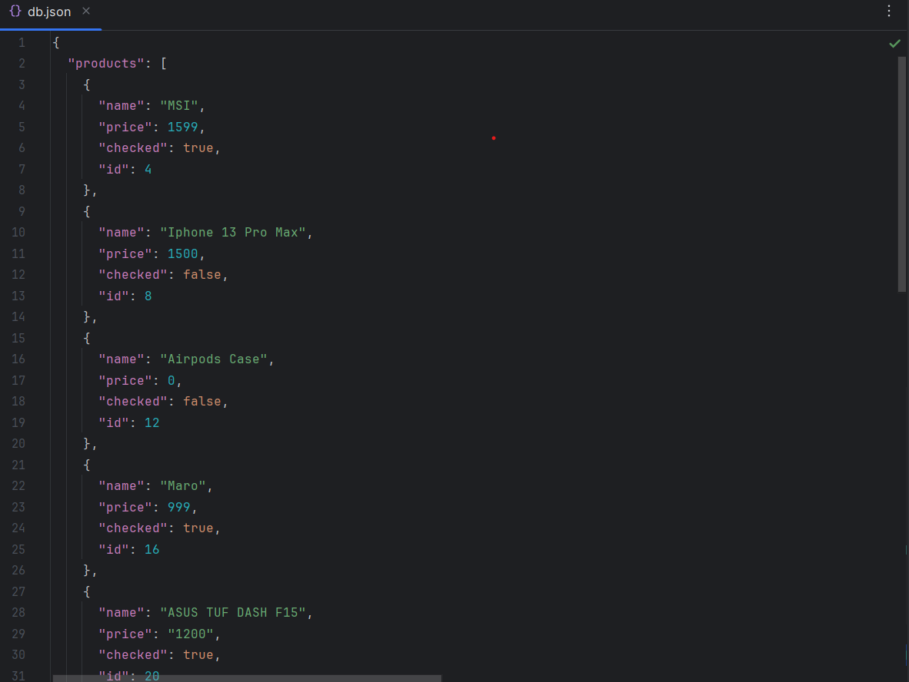
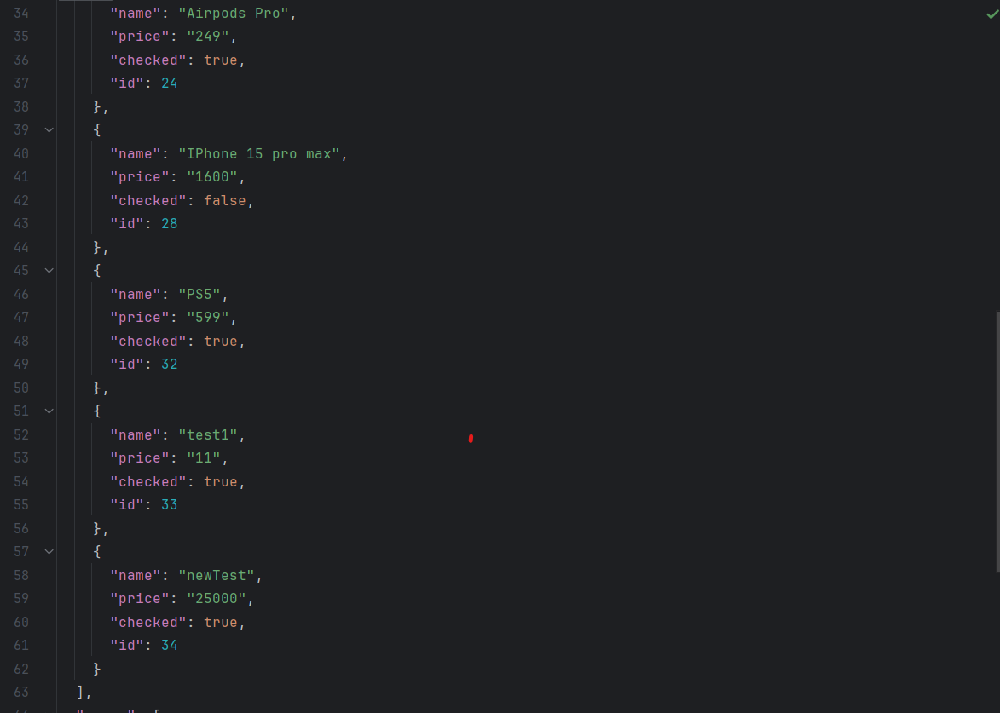

 
Mais d'abord nous allons installer json-server avec:
 
"npm i json-server" et "npm i json-server-auth"

Et pour demarrer json server:
 
"json-server -w data/db.json -p 9000"

 

J'ai cree pour l'admin le JWT avec les roles: "ADMIN" et "USER":

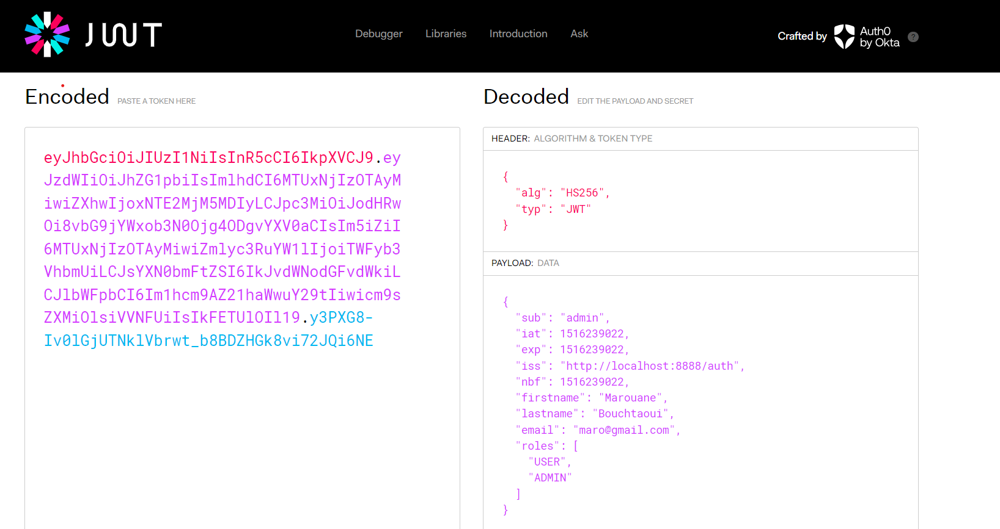

 

Login page :

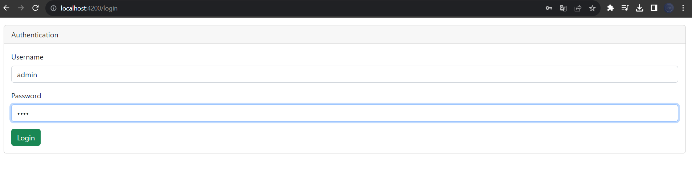

 

Pour l'admin: il peut consulter les produits, les modifier et les supprimer

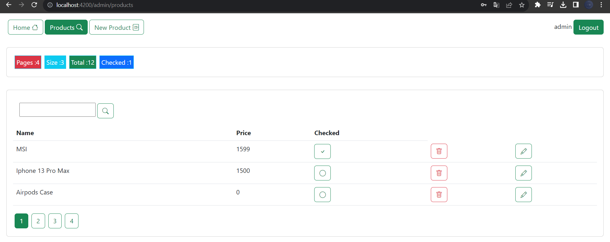

 

Pour creer un produit if faut remplir et respecter le formulaire de la creation:

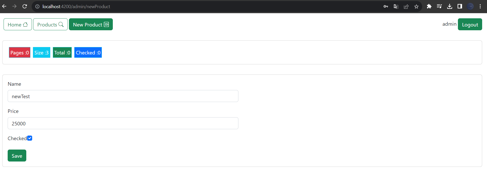

 

Un message sera affiché lors de la création du produit:

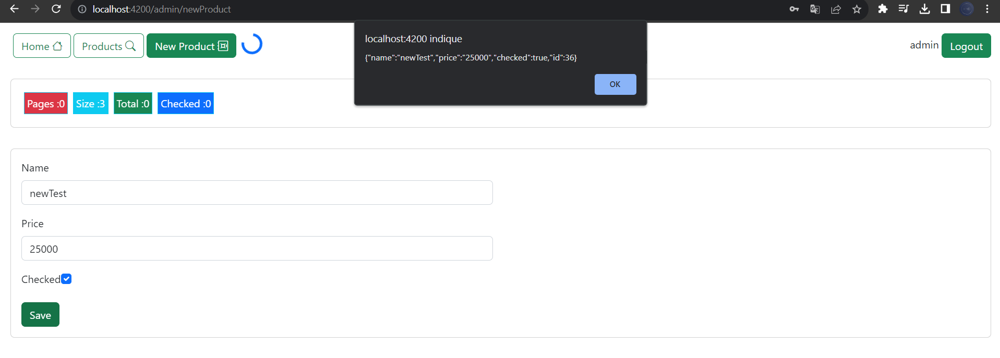

 

J'ai cree pour User le JWT avec le role: "USER"

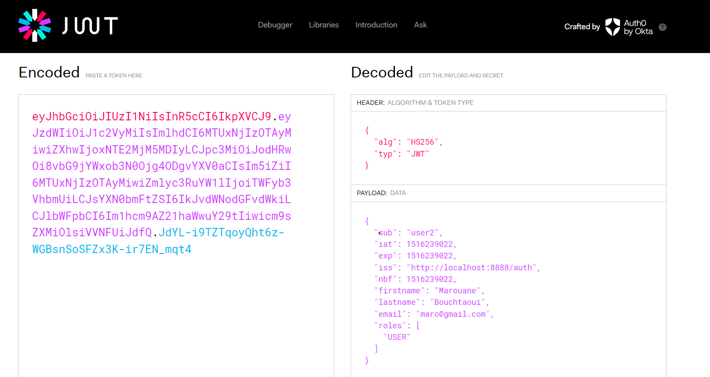

 

Login page :

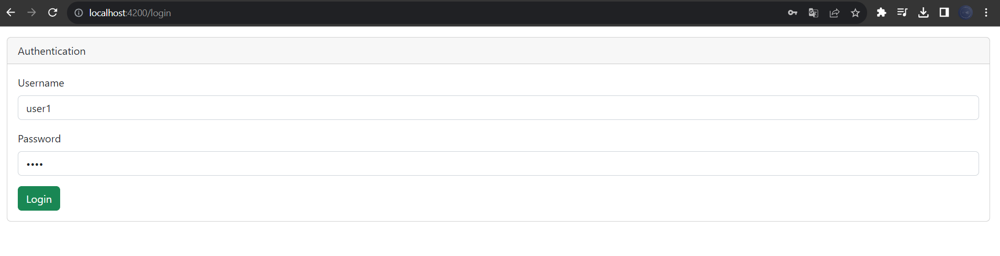

 

Pour l'User: il peut seulement consulter les produits

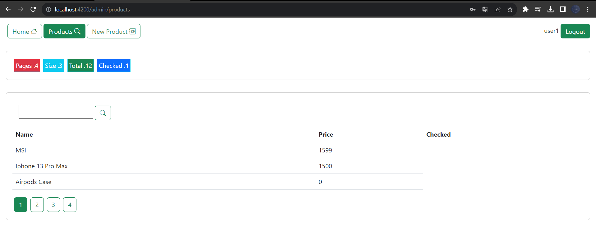

 

Lorsque l'utilisateur essaye de creer un produit on affiche la page de "Not Authorized" 

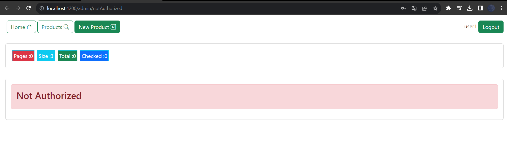
